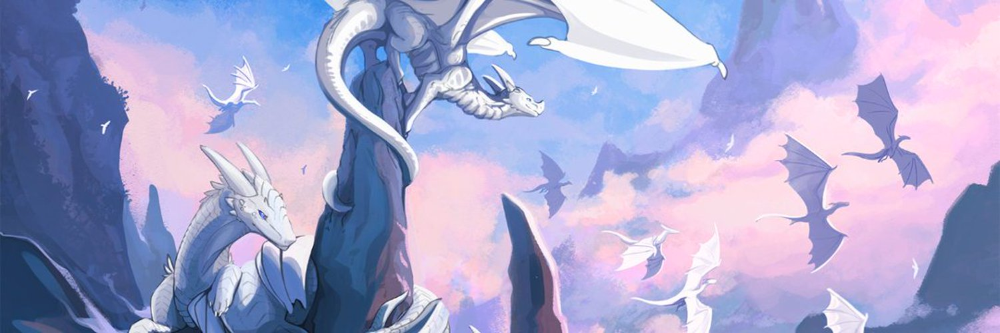

# Hey I am Sorine
### I am a beginner developer thats currently learning Python and C#. 
### I also am an Digital "Raster" image artist and a traditional Acrylic painter, I also ocasionally do sculpting!
## Tool(s):
- IDE: Zed
- OS: Arch (btw)
- Version Control Software: git (obviously lol)
- Art/Imagery: Krita 
## My webpage
- [Github Website](https://TheEpicDragons.github.io/)

### More cool links
- [Discord](https://discord.gg/Uy6KrV9zRd/)
- [ArtStreet](https://medibang.com/u/Blitzdrachen/)
- [Twitter](https://mobile.twitter.com/Blitzdrachen_/)

## Most used languages

## Stats
<table width="100%"  border="0" cellpadding="0" cellspacing="0">
  <tr>
    <td align="center">
    
  </td>
